# 23726841_NguyenThanhNghia_cabsystem

# Bước 1: Tổng quan hệ thống

## 1.1. Vấn đề của hệ thống hiện tại


Hệ thống CAB hiện tại đang tồn tại một số vấn đề:

- Việc phân công tài xế chủ yếu được thực hiện thủ công.
- Khách hàng khó theo dõi trạng thái chuyến đi.
- Thông tin thanh toán chưa được quản lý tập trung.
- Việc tìm kiếm và phân công tài xế chưa được tự động hóa.
- Khi tài xế từ chối hoặc không phản hồi, khách hàng có thể phải chờ lâu.
- Khó xử lý số lượng lớn yêu cầu đặt xe vào thời điểm cao điểm.
- Bộ phận vận hành gặp khó khăn trong việc theo dõi tài xế và các chuyến đang diễn ra.
- Khó tra cứu lịch sử chuyến đi và giao dịch.
- Hệ thống thông báo chưa có kiến trúc linh hoạt để mở rộng thêm nhiều kênh.
- Khó mở rộng hệ thống khi số lượng khách hàng và tài xế tăng.
- Chưa có đầy đủ cơ chế phân quyền và lưu vết các thao tác quan trọng.
- Một số nghiệp vụ chưa được xác định rõ như:
  - Cách tính cước.
  - Tiêu chí ưu tiên tài xế.
  - Thời gian tài xế phản hồi.
  - Chính sách hủy chuyến.
  - Xử lý khi mất kết nối.
  - Thời gian lưu trữ dữ liệu.
## 1.2. Mục tiêu đem lại

Hệ thống CAB mới được xây dựng nhằm:

### Đối với khách hàng

- Đặt xe nhanh chóng và thuận tiện.
- Theo dõi trạng thái chuyến đi.
- Biết thông tin tài xế và thời gian dự kiến đến.
- Xem lịch sử chuyến đi.
- Biết số tiền cần thanh toán.
- Hỗ trợ thanh toán tiền mặt và điện tử.
- Đánh giá tài xế sau khi hoàn thành chuyến.

### Đối với tài xế

- Nhận chuyến tự động dựa trên tiêu chí phù hợp.
- Chủ động chuyển trạng thái sẵn sàng nhận chuyến.
- Nhận thông báo khi có chuyến mới.
- Chấp nhận hoặc từ chối chuyến.
- Cập nhật trạng thái chuyến.
- Cập nhật vị trí để hỗ trợ tìm kiếm tài xế.

### Đối với nhân viên vận hành

- Quản lý khách hàng, tài xế và phương tiện.
- Theo dõi các chuyến đang diễn ra.
- Theo dõi trạng thái tài xế.
- Hỗ trợ xử lý các chuyến bị lỗi.
- Tra cứu lịch sử chuyến đi và giao dịch.
- Theo dõi và quản lý hoạt động của hệ thống.

### Đối với doanh nghiệp

- Tự động hóa quy trình đặt và phân công xe.
- Giảm sự phụ thuộc vào thao tác thủ công.
- Tăng khả năng phục vụ số lượng lớn khách hàng và tài xế.
- Quản lý tập trung dữ liệu chuyến đi và thanh toán.
- Nâng cao khả năng giám sát và báo cáo.
- Đảm bảo bảo mật và phân quyền.
- Có khả năng mở rộng thêm:
  - Loại dịch vụ.
  - Phương thức thanh toán.
  - Nhà cung cấp thanh toán.
  - Kênh thông báo.
  - Các chức năng mới trong tương lai.

---
## 1.3. Ai sử dụng hệ thống?

Hệ thống có 3 nhóm người dùng chính:

| Người dùng | Vai trò | Chức năng chính |
|---|---|---|
| **Customer** | Khách hàng | Đăng ký, đặt xe, theo dõi chuyến, thanh toán, đánh giá |
| **Driver** | Tài xế | Nhận chuyến, cập nhật vị trí, cập nhật trạng thái, hoàn thành chuyến |
| **Operation Staff** | Nhân viên vận hành | Quản lý khách hàng, tài xế, phương tiện, chuyến đi và xử lý sự cố |

### Các bên sử dụng / tương tác khác

| Người dùng / Hệ thống | Vai trò |
|---|---|
| **System Admin** | Quản trị tài khoản, phân quyền và cấu hình hệ thống |
| **Management** | Xem báo cáo, KPI, doanh thu và hiệu quả hoạt động |
| **Finance / Accounting** | Theo dõi giao dịch, thanh toán và doanh thu |
| **Customer Support** | Hỗ trợ khách hàng và tra cứu thông tin chuyến |
| **Payment Gateway** | Xử lý thanh toán điện tử |
| **Notification Provider** | Gửi Push Notification, SMS, Email hoặc các kênh khác |

---
## Bước 2: Stakeholder Analysis

## 2.1. Các bên liên quan – Stakeholder

| # | Stakeholder | Vai trò |
|---|---|---|
| 1 | **Management** | Chủ dự án, định hướng kinh doanh, theo dõi KPI, doanh thu và hiệu quả hoạt động |
| 2 | **Customer** | Người sử dụng dịch vụ, đặt xe, theo dõi chuyến, thanh toán và đánh giá tài xế |
| 3 | **Driver** | Người cung cấp dịch vụ vận chuyển, nhận và thực hiện chuyến |
| 4 | **Operation Staff** | Quản lý hoạt động đặt xe, theo dõi chuyến, tài xế và xử lý sự cố vận hành |
| 5 | **System Admin** | Quản trị tài khoản, phân quyền và cấu hình hệ thống |
| 6 | **Finance / Accounting** | Theo dõi giao dịch, thanh toán và doanh thu |
| 7 | **Customer Support** | Hỗ trợ khách hàng và tra cứu thông tin chuyến đi |
| 8 | **Payment Provider** | Cung cấp dịch vụ xử lý thanh toán điện tử |
| 9 | **Notification Provider** | Cung cấp dịch vụ gửi Push Notification, SMS, Email hoặc các kênh khác |
| 10 | **Map / Location Provider** | Cung cấp bản đồ, định vị, khoảng cách và dữ liệu hỗ trợ tính ETA |

---

## 2.2. Stakeholder Matrix

| Stakeholder | Power | Interest | Strategy |
|---|---|---|---|
| **Management** | Cao | Cao | **Manage Closely** – Cập nhật tiến độ, rủi ro, KPI, doanh thu và các quyết định quan trọng |
| **Customer** | Thấp | Cao | **Keep Informed** – Thu thập feedback và cung cấp thông tin về các thay đổi ảnh hưởng đến trải nghiệm |
| **Driver** | Thấp | Cao | **Keep Informed** – Thu thập nhu cầu, feedback và đảm bảo quy trình nhận/thực hiện chuyến phù hợp |
| **Operation Staff** | Cao | Cao | **Manage Closely** – Tham gia phân tích nghiệp vụ, kiểm thử và xác nhận quy trình vận hành |
| **System Admin** | Cao | Cao | **Manage Closely** – Xác định yêu cầu quản trị, phân quyền, cấu hình và bảo mật hệ thống |
| **Finance / Accounting** | Cao | Trung bình | **Keep Satisfied** – Đảm bảo yêu cầu về giao dịch, thanh toán và báo cáo doanh thu |
| **Customer Support** | Trung bình | Cao | **Keep Informed** – Cung cấp công cụ tra cứu và hỗ trợ xử lý các vấn đề của khách hàng |
| **Payment Provider** | Cao | Trung bình | **Keep Satisfied** – Đảm bảo tích hợp, giao dịch và xử lý lỗi thanh toán hoạt động ổn định |
| **Notification Provider** | Trung bình | Trung bình | **Monitor** – Theo dõi khả năng tích hợp và trạng thái dịch vụ |
| **Map / Location Provider** | Cao | Trung bình | **Keep Satisfied** – Đảm bảo dữ liệu vị trí, khoảng cách và ETA hoạt động ổn định |
## 2.2. Stakeholder Matrix 
 
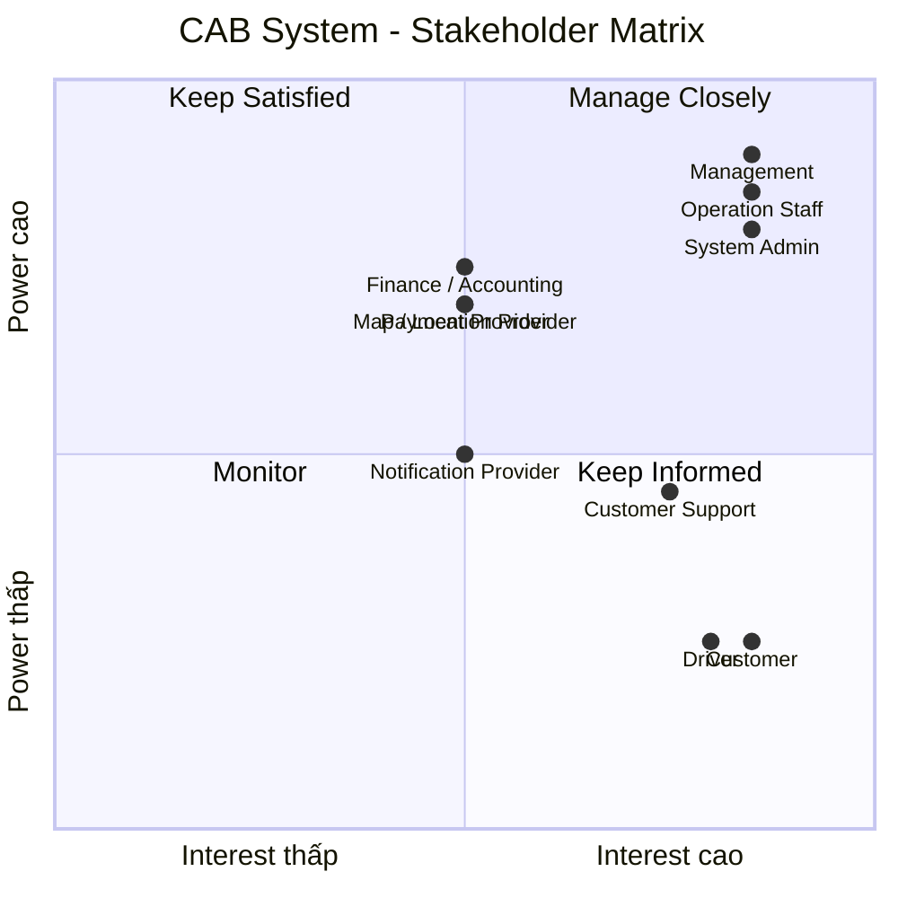

---


# Bước 3: Business Objectives

## 3.1. Mục đích nghiệp vụ

| ID | Mục đích nghiệp vụ | Mô tả |
|---|---|---|
| **BO-01** | **Cải thiện trải nghiệm khách hàng** | Giúp khách hàng đặt xe nhanh chóng, theo dõi trạng thái chuyến, biết thông tin tài xế và thời gian dự kiến đến, xem lịch sử, thanh toán và đánh giá tài xế. |
| **BO-02** | **Tự động hóa quy trình đặt xe** | Giảm sự phụ thuộc vào tổng đài và thao tác thủ công trong việc tiếp nhận yêu cầu, tìm kiếm và phân công tài xế. |
| **BO-03** | **Nâng cao hiệu quả phân công tài xế** | Tự động tìm và ưu tiên tài xế phù hợp dựa trên vị trí, trạng thái sẵn sàng và các tiêu chí vận hành. |
| **BO-04** | **Nâng cao hiệu quả vận hành** | Cung cấp công cụ giúp nhân viên vận hành theo dõi chuyến đi, trạng thái tài xế, quản lý phương tiện và xử lý các trường hợp bất thường. |
| **BO-05** | **Quản lý tập trung dữ liệu** | Tập trung quản lý thông tin khách hàng, tài xế, phương tiện, chuyến đi, giao dịch và lịch sử hoạt động. |
| **BO-06** | **Nâng cao hiệu quả thanh toán** | Chuẩn hóa việc tính cước và hỗ trợ thanh toán tiền mặt hoặc thanh toán điện tử thông qua nhà cung cấp bên ngoài. |
| **BO-07** | **Nâng cao khả năng giám sát và ra quyết định** | Cung cấp dữ liệu và báo cáo về số lượng chuyến, doanh thu, tỷ lệ hoàn thành, tỷ lệ hủy và hiệu quả hoạt động của tài xế. |
| **BO-08** | **Đảm bảo khả năng mở rộng và ổn định** | Xây dựng hệ thống có khả năng phục vụ số lượng lớn khách hàng và tài xế, đồng thời hạn chế ảnh hưởng khi một thành phần gặp sự cố. |
| **BO-09** | **Tăng khả năng mở rộng tính năng** | Cho phép bổ sung loại dịch vụ, phương thức thanh toán, nhà cung cấp thanh toán, kênh thông báo và các chức năng mới trong tương lai. |
| **BO-10** | **Đảm bảo bảo mật và kiểm soát hệ thống** | Bảo vệ dữ liệu cá nhân, dữ liệu vị trí và dữ liệu giao dịch; kiểm soát quyền truy cập và lưu vết các thao tác quan trọng. |

---

## 4. Kế hoạch triển khai 7 tuần

| Tuần | Module | Nội dung chính |
|---|---|---|
| **Tuần 1** | **M01 - Xác thực & Quản lý tài khoản** | Đăng ký, đăng nhập, xác thực, cập nhật thông tin và phân quyền |
| **Tuần 2** | **M02 - Quản lý khách hàng** + **M03 - Quản lý tài xế & phương tiện** | Hồ sơ khách hàng, tài xế, phương tiện và trạng thái hoạt động |
| **Tuần 3** | **M04 - Đặt xe** | Tạo yêu cầu, điểm đón, điểm đến, loại xe và quản lý yêu cầu đặt xe |
| **Tuần 4** | **M05 - Phân công tài xế** + **M06 - Quản lý chuyến đi & định vị** | Tìm tài xế, phân công, xử lý từ chối/timeout, trạng thái chuyến và vị trí |
| **Tuần 5** | **M07 - Tính cước & thanh toán** | Tính cước, tiền mặt, thanh toán điện tử và xử lý giao dịch thất bại |
| **Tuần 6** | **M08 - Thông báo** + **M09 - Vận hành & quản trị** + **M10 - Báo cáo & kiểm toán** | Thông báo, quản lý vận hành, báo cáo, phân quyền và audit log |
| **Tuần 7** | **Tích hợp & hoàn thiện** | Kiểm thử tích hợp, kiểm thử nghiệm thu, sửa lỗi, kiểm thử hiệu năng, triển khai và bàn giao |
## 5. Yêu cầu nghiệp vụ (Business Requirements)

| ID     | Yêu cầu nghiệp vụ | Mô tả |
|--------|---|---|
| BR-01 | **Đặt xe trực tuyến** | Cho phép khách hàng đặt xe trực tuyến, chọn điểm đi, điểm đến một cách nhanh chóng và thuận tiện. |
| BR-02 | **Tự động tìm và phân công tài xế** | Tự động tìm tài xế phù hợp dựa trên vị trí, trạng thái sẵn sàng và các tiêu chí vận hành. |
| BR-03 | **Theo dõi chuyến đi** | Cho phép khách hàng theo dõi trạng thái chuyến đi, thông tin tài xế và thời gian dự kiến tài xế đến. |
| BR-04 | **Đánh giá chuyến đi** | Cho phép khách hàng đánh giá tài xế sau khi chuyến đi hoàn thành và ghi nhận phản hồi để doanh nghiệp theo dõi chất lượng dịch vụ. |
| BR-05 | **Tính cước** | Xác định số tiền khách hàng phải trả dựa trên thông tin chuyến đi và chính sách tính cước của doanh nghiệp. |
| BR-06 | **Quản lý thanh toán** | Hỗ trợ thanh toán tiền mặt và thanh toán điện tử thông qua nhà cung cấp thanh toán bên ngoài. |
| BR-07 | **Quản lý thông báo** | Gửi thông báo cho khách hàng và tài xế về các sự kiện quan trọng trong quá trình đặt và thực hiện chuyến đi. |
| BR-08 | **Quản lý tài xế và phương tiện** | Cho phép quản lý thông tin tài xế, phương tiện, trạng thái hoạt động và vị trí của tài xế. |
| BR-09 | **Quản lý vận hành** | Cung cấp công cụ để nhân viên vận hành quản lý khách hàng, tài xế, phương tiện, chuyến đi và giao dịch. |
| BR-10 | **Báo cáo và thống kê** | Cung cấp báo cáo về số lượng chuyến, doanh thu, tỷ lệ hoàn thành, tỷ lệ hủy và hiệu quả hoạt động của tài xế. |
| BR-11 | **Bảo mật và kiểm soát truy cập** | Bảo vệ thông tin cá nhân, dữ liệu vị trí, dữ liệu giao dịch và kiểm soát quyền truy cập của người dùng. |
| BR-12 | **Khả năng mở rộng và ổn định** | Đảm bảo hệ thống có thể phục vụ số lượng lớn người dùng và hạn chế ảnh hưởng khi một thành phần gặp sự cố. |
| BR-13 | **Khả năng mở rộng tính năng** | Cho phép bổ sung loại dịch vụ, phương thức thanh toán, kênh thông báo và các tính năng mới trong tương lai. |
## 6. Yêu cầu chức năng (Functional Requirements)
| ID | Yêu cầu chức năng | Mô tả |
|---|---|---|
| FR-02.01 | Xác định vị trí tài xế | Hệ thống xác định vị trí hiện tại của các tài xế đang hoạt động để phục vụ việc tìm kiếm tài xế phù hợp. |
| FR-02.02 | Kiểm tra trạng thái tài xế | Hệ thống chỉ gửi yêu cầu chuyến đến các tài xế đang ở trạng thái sẵn sàng nhận chuyến (`AVAILABLE`). |
| FR-02.03 | Kiểm tra loại xe | Hệ thống kiểm tra loại xe của tài xế và chỉ đề xuất tài xế có loại xe phù hợp với yêu cầu của khách hàng. |
| FR-02.04 | Xếp hạng tài xế | Hệ thống sắp xếp các tài xế phù hợp dựa trên các tiêu chí nghiệp vụ. Tài xế có đánh giá cao được ưu tiên. |
| FR-02.05 | Ưu tiên tài xế gần khách hàng | Hệ thống ưu tiên các tài xế phù hợp có vị trí gần điểm đón của khách hàng. |
| FR-02.06 | Gửi yêu cầu nhận chuyến | Hệ thống gửi yêu cầu nhận chuyến đến tài xế được ưu tiên. |
| FR-02.07 | Chờ tài xế xác nhận | Hệ thống chờ tài xế phản hồi yêu cầu nhận chuyến trong khoảng thời gian được quy định. |
| FR-02.08 | Xử lý tài xế từ chối | Nếu tài xế từ chối chuyến, hệ thống tiếp tục tìm và gửi yêu cầu đến tài xế phù hợp tiếp theo. |
| FR-02.09 | Xử lý tài xế không phản hồi | Nếu tài xế không phản hồi trong thời gian quy định, hệ thống xem yêu cầu là hết thời gian chờ và tiếp tục tìm tài xế khác. |
| FR-02.10 | Xác nhận tài xế | Khi tài xế chấp nhận chuyến, hệ thống ghi nhận tài xế và cập nhật trạng thái chuyến sang `DRIVER_ASSIGNED`. |
| FR-02.11 | Không tìm được tài xế | Nếu không tìm được tài xế phù hợp, hệ thống thông báo cho khách hàng và cập nhật trạng thái chuyến tương ứng. |
---
## 7. Vẽ Usecase
## 7.1. Tổng quan
Use Case được xây dựng dựa trên các yêu cầu chức năng và quy trình nghiệp vụ của hệ thống CAB System.
Các Actor chính của hệ thống gồm:
- **Customer:** Khách hàng sử dụng dịch vụ đặt xe.
- **Driver:** Tài xế nhận và thực hiện chuyến.
- **Operation Staff:** Nhân viên vận hành, giám sát và xử lý các vấn đề trong hệ thống.
- **System Admin:** Quản trị tài khoản và phân quyền.
- **Payment Gateway:** Hệ thống thanh toán bên ngoài.
- **Notification Provider:** Nhà cung cấp dịch vụ thông báo.
---
## 7.2. Use Case Diagram tổng quát
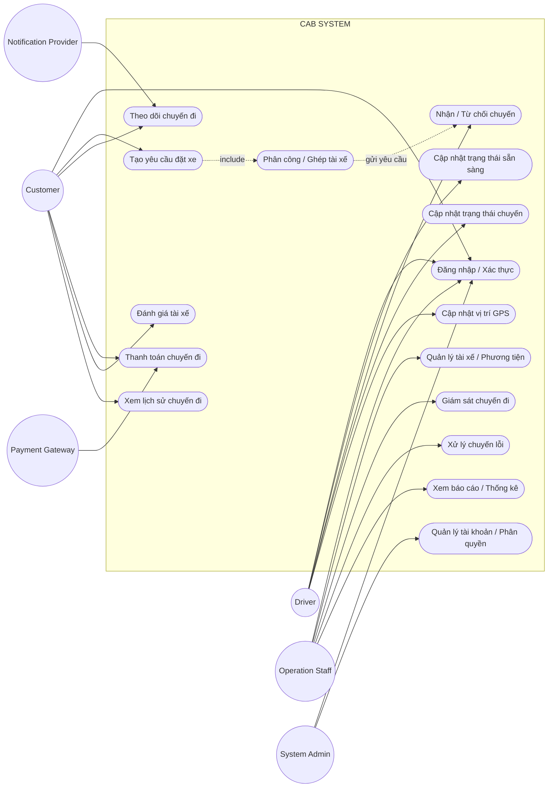
---
## 7.3. Use Case của Customer
Customer là người sử dụng chính của hệ thống CAB.
| ID | Use Case | Mô tả |
|---|---|---|
| UC01 | Đăng nhập / Xác thực | Customer đăng nhập và xác thực tài khoản |
| UC02 | Tạo yêu cầu đặt xe | Nhập điểm đón, điểm đến và loại xe |
| UC03 | Theo dõi chuyến đi | Theo dõi trạng thái chuyến |
| UC04 | Thanh toán chuyến đi | Thanh toán bằng tiền mặt hoặc điện tử |
| UC05 | Đánh giá tài xế | Đánh giá tài xế sau khi hoàn thành chuyến |
| UC06 | Xem lịch sử chuyến đi | Xem các chuyến đã thực hiện |
---
## 7.4. Use Case của Driver
Driver thực hiện các chức năng liên quan đến nhận và thực hiện chuyến.
| ID | Use Case | Mô tả |
|---|---|---|
| UC07 | Cập nhật trạng thái sẵn sàng | Chuyển sang trạng thái sẵn sàng nhận chuyến |
| UC08 | Nhận / Từ chối chuyến | Phản hồi yêu cầu đặt xe |
| UC09 | Cập nhật trạng thái chuyến | Cập nhật trạng thái chuyến trong quá trình thực hiện |
| UC10 | Cập nhật vị trí GPS | Gửi vị trí hiện tại của Driver |
| UC01 | Đăng nhập / Xác thực | Driver đăng nhập và xác thực tài khoản |
---
## 7.5. Use Case của Operation Staff
Operation Staff chịu trách nhiệm vận hành và giám sát hệ thống.
| ID | Use Case | Mô tả |
|---|---|---|
| UC12 | Quản lý tài xế / Phương tiện | Quản lý thông tin Driver và phương tiện |
| UC13 | Giám sát chuyến đi | Theo dõi các Trip đang diễn ra |
| UC14 | Xử lý chuyến lỗi | Hỗ trợ xử lý các trường hợp Trip gặp sự cố |
| UC15 | Xem báo cáo / Thống kê | Xem số lượng Trip, doanh thu và các chỉ số hoạt động |
| UC01 | Đăng nhập / Xác thực | Staff đăng nhập hệ thống |
---
## 7.6. Use Case của System Admin
System Admin chịu trách nhiệm quản lý tài khoản và quyền truy cập.
| ID | Use Case | Mô tả |
|---|---|---|
| UC01 | Đăng nhập / Xác thực | Admin đăng nhập hệ thống |
| UC16 | Quản lý tài khoản / Phân quyền | Quản lý tài khoản và quyền truy cập |
---
## 7.7. Use Case của hệ thống bên ngoài
### Payment Gateway
Payment Gateway được sử dụng để xử lý các giao dịch thanh toán điện tử.
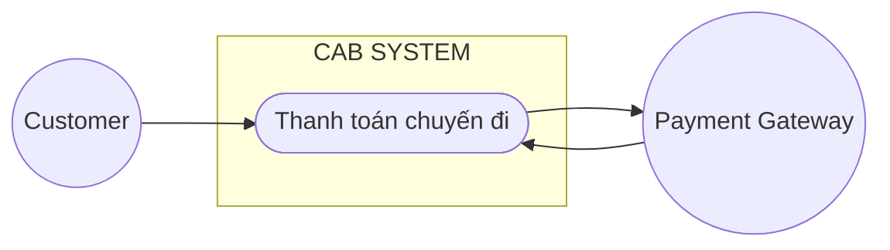
CAB System không lưu trực tiếp thông tin nhạy cảm của thẻ hoặc tài khoản thanh toán.
---
### Notification Provider
Notification Provider hỗ trợ gửi các thông báo đến Customer và Driver.
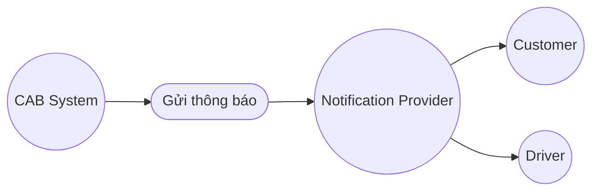
Các sự kiện có thể phát sinh thông báo:
- Yêu cầu đặt xe được tiếp nhận.
- Driver nhận chuyến.
- Driver đến điểm đón.
- Chuyến đi hoàn thành.
- Thanh toán thành công hoặc thất bại.
- Có thay đổi liên quan đến chuyến đi.
---
## 7.8. Quy trình Use Case chính – Đặt xe
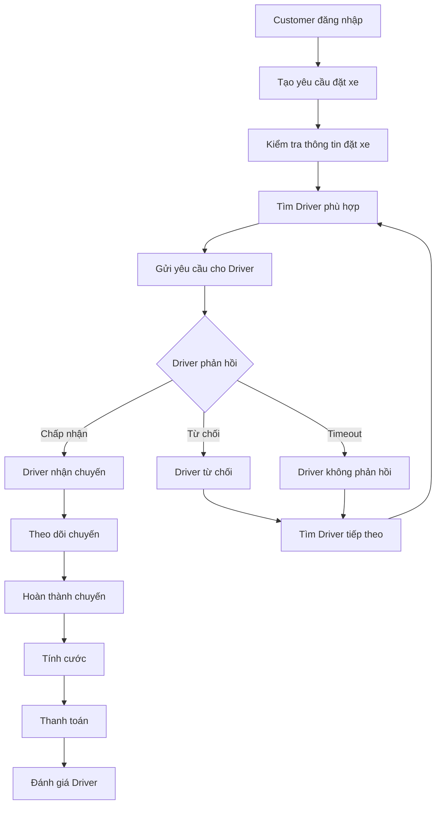
---
## 7.9. Quy trình Use Case – Tìm và phân công Driver
Khi Customer tạo yêu cầu đặt xe, hệ thống sẽ tìm Driver phù hợp dựa trên các thông tin vận hành.
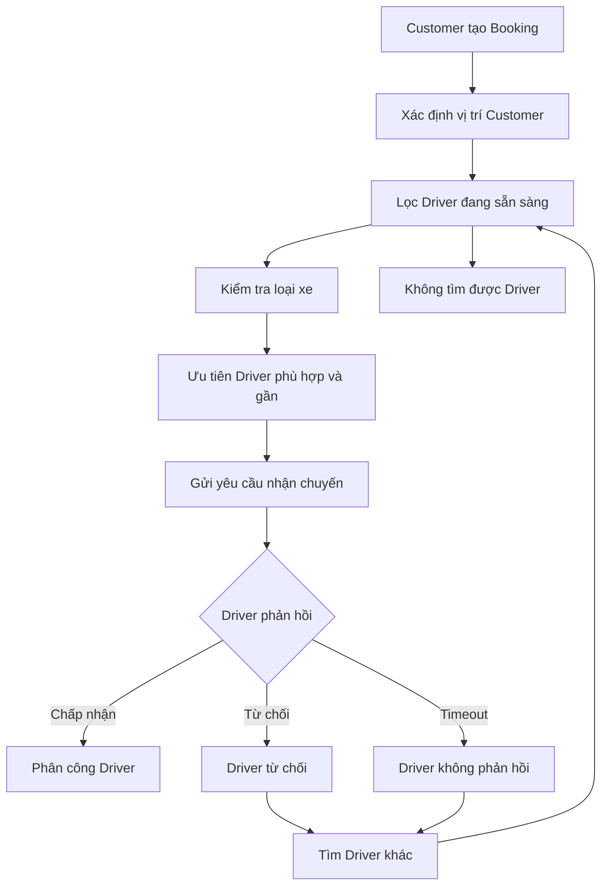
> Tiêu chí ưu tiên Driver, thời gian phản hồi và số lần hệ thống tìm lại Driver cần được xác nhận với khách hàng trước khi triển khai.
---
## 7.10. Quy trình Use Case – Thực hiện chuyến
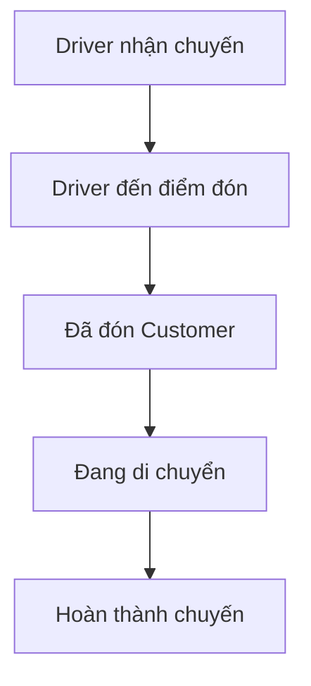
Các trạng thái chính của Trip:
```text
ASSIGNED
    ↓
DRIVER_ARRIVED
    ↓
PASSENGER_PICKED_UP
    ↓
IN_PROGRESS
    ↓
COMPLETED
```
---
## 7.11. Quy trình Use Case – Thanh toán
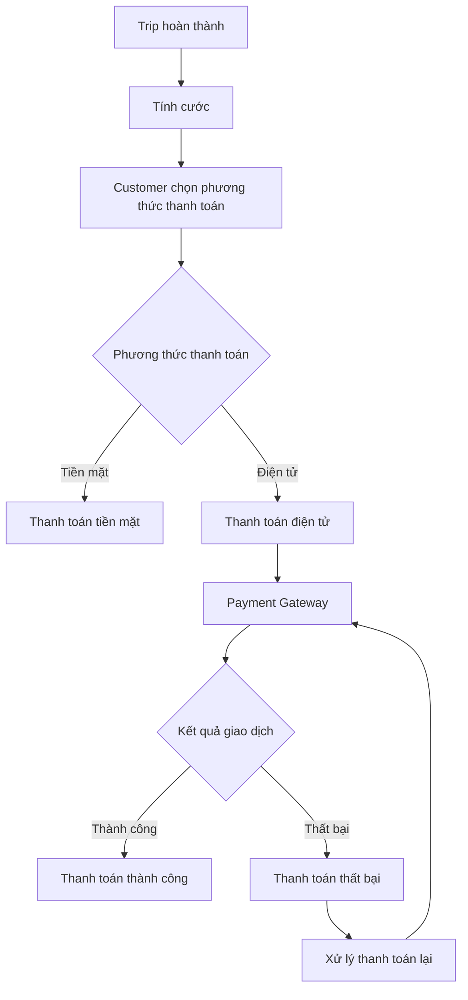
CAB System chỉ quản lý trạng thái và thông tin cần thiết của giao dịch, không lưu trực tiếp dữ liệu nhạy cảm của phương thức thanh toán.
---
## 7.12. Quy trình Use Case – Notification
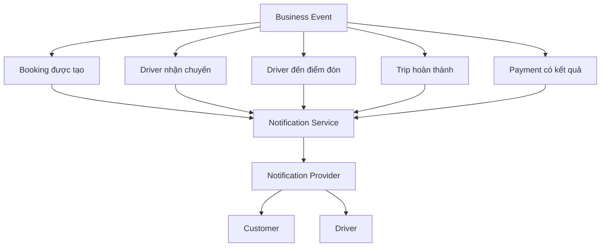
---
## 7.13. Danh sách Use Case chính
| ID | Use Case | Actor chính |
|---|---|---|
| UC01 | Đăng nhập / Xác thực | Customer, Driver, Staff, Admin |
| UC02 | Tạo yêu cầu đặt xe | Customer |
| UC03 | Theo dõi chuyến đi | Customer |
| UC04 | Thanh toán chuyến đi | Customer |
| UC05 | Đánh giá tài xế | Customer |
| UC06 | Xem lịch sử chuyến đi | Customer |
| UC07 | Cập nhật trạng thái sẵn sàng | Driver |
| UC08 | Nhận / Từ chối chuyến | Driver |
| UC09 | Cập nhật trạng thái chuyến | Driver |
| UC10 | Cập nhật vị trí GPS | Driver |
| UC11 | Phân công / Ghép tài xế | System |
| UC12 | Quản lý tài xế / Phương tiện | Operation Staff |
| UC13 | Giám sát chuyến đi | Operation Staff |
| UC14 | Xử lý chuyến lỗi | Operation Staff |
| UC15 | Xem báo cáo / Thống kê | Operation Staff |
| UC16 | Quản lý tài khoản / Phân quyền | System Admin |
---
## 7.14. Mapping Use Case với Service
Các Use Case được sử dụng làm cơ sở để phân chia các Service:
| Service | Use Case chính |
|---|---|
| Authentication Service | UC01 – Đăng nhập / Xác thực |
| Booking Service | UC02 – Tạo yêu cầu đặt xe |
| Dispatch Service | UC11 – Phân công / Ghép tài xế |
| Trip Service | UC03, UC09 – Theo dõi và cập nhật Trip |
| Location Service | UC10 – Cập nhật vị trí GPS |
| Fare Service | Tính cước |
| Payment Service | UC04 – Thanh toán |
| Notification Service | Gửi thông báo |
| Rating Service | UC05 – Đánh giá tài xế |
| Customer Service | UC06 – Lịch sử chuyến |
| Driver Service | UC07, UC08 – Quản lý Driver |
| Operation Service | UC12, UC13, UC14, UC15 |
| Authorization Service | UC16 – Quản lý tài khoản / Phân quyền |
---
## 7.15. Các vấn đề cần xác nhận
Một số yêu cầu nghiệp vụ hiện chưa được khách hàng chốt hoàn toàn:
| Vấn đề | Use Case liên quan |
|---|---|
| Công thức tính cước | Thanh toán / Tính cước |
| Tiêu chí ưu tiên Driver | Phân công Driver |
| Thời gian Driver phải phản hồi | Nhận / Từ chối chuyến |
| Số lần tìm lại Driver | Phân công Driver |
| Chính sách hủy chuyến | Đặt xe / Theo dõi Trip |
| Cách xử lý mất kết nối | Theo dõi Trip / GPS |
| Cách Retry khi Payment thất bại | Thanh toán |
| Tần suất cập nhật GPS | Cập nhật vị trí |
| Thời gian lưu trữ dữ liệu | Lịch sử / Giao dịch |
Các nội dung trên cần được Business Analyst xác nhận với khách hàng trước khi chuyển sang giai đoạn thiết kế và triển khai.
---
# 8. ĐẶC TẢ USE CASE
## 8.1. Mục đích
Đặc tả Use Case nhằm mô tả chi tiết cách Actor tương tác với hệ thống CAB System để thực hiện từng nghiệp vụ.
Mỗi Use Case bao gồm:
- Actor thực hiện.
- Mục tiêu nghiệp vụ.
- Điều kiện tiên quyết.
- Luồng chính.
- Luồng thay thế / ngoại lệ.
- Điều kiện kết thúc.
Các Use Case được ưu tiên đặc tả là những nghiệp vụ quan trọng đối với quy trình đặt xe, phân công tài xế, thực hiện chuyến và thanh toán.
---
# 8.2. UC01 – Đăng nhập / Xác thực
| Thuộc tính | Nội dung |
|---|---|
| **Use Case ID** | UC01 |
| **Tên** | Đăng nhập / Xác thực |
| **Actor chính** | Customer, Driver, Operation Staff, System Admin |
| **Mục tiêu** | Cho phép người dùng xác thực để sử dụng các chức năng tương ứng |
| **Tiền điều kiện** | Người dùng đã có tài khoản |
| **Hậu điều kiện** | Người dùng đăng nhập thành công và được cấp quyền truy cập |
### Luồng chính
1. Người dùng nhập thông tin đăng nhập.
2. Hệ thống kiểm tra thông tin tài khoản.
3. Hệ thống xác thực thông tin đăng nhập.
4. Hệ thống kiểm tra trạng thái tài khoản.
5. Hệ thống xác định quyền của người dùng.
6. Hệ thống tạo phiên đăng nhập.
7. Người dùng được chuyển đến chức năng tương ứng.
### Luồng thay thế
- **A1:** Sai thông tin đăng nhập → Hệ thống thông báo lỗi.
- **A2:** Tài khoản bị khóa → Hệ thống từ chối đăng nhập.
- **A3:** Tài khoản không tồn tại → Hệ thống yêu cầu kiểm tra lại thông tin.
---
# 8.3. UC02 – Tạo yêu cầu đặt xe
| Thuộc tính | Nội dung |
|---|---|
| **Use Case ID** | UC02 |
| **Tên** | Tạo yêu cầu đặt xe |
| **Actor chính** | Customer |
| **Mục tiêu** | Tạo một yêu cầu đặt xe mới |
| **Tiền điều kiện** | Customer đã đăng nhập |
| **Hậu điều kiện** | Booking được tạo và chuyển sang bước tìm Driver |
### Luồng chính
1. Customer chọn chức năng đặt xe.
2. Customer nhập điểm đón.
3. Customer nhập điểm đến.
4. Customer chọn loại xe.
5. Hệ thống kiểm tra thông tin Booking.
6. Hệ thống tạo Booking.
7. Hệ thống gửi thông tin Booking đến Dispatch Service.
8. Hệ thống bắt đầu tìm Driver phù hợp.
9. Hệ thống thông báo trạng thái tiếp nhận yêu cầu cho Customer.
### Luồng thay thế
- **A1:** Thiếu điểm đón hoặc điểm đến → Hệ thống yêu cầu nhập đầy đủ.
- **A2:** Loại xe không hợp lệ → Hệ thống yêu cầu chọn lại.
- **A3:** Không có Driver phù hợp → Hệ thống thông báo chưa tìm được Driver.
---
# 8.4. UC03 – Theo dõi chuyến đi
| Thuộc tính | Nội dung |
|---|---|
| **Use Case ID** | UC03 |
| **Tên** | Theo dõi chuyến đi |
| **Actor chính** | Customer |
| **Mục tiêu** | Cho phép Customer theo dõi trạng thái Trip |
| **Tiền điều kiện** | Customer đã đăng nhập và có Trip |
| **Hậu điều kiện** | Customer xem được trạng thái mới nhất của Trip |
### Luồng chính
1. Customer mở Trip đang thực hiện.
2. Hệ thống lấy thông tin Trip.
3. Hệ thống lấy trạng thái hiện tại.
4. Hệ thống lấy thông tin Driver.
5. Hệ thống lấy vị trí Driver nếu có.
6. Hệ thống hiển thị thông tin cho Customer.
7. Hệ thống cập nhật trạng thái khi có thay đổi.
### Luồng thay thế
- **A1:** Không có dữ liệu vị trí mới → Hiển thị vị trí gần nhất.
- **A2:** Trip đã hoàn thành → Hiển thị thông tin kết thúc Trip.
- **A3:** Mất kết nối → Hiển thị trạng thái gần nhất và thông báo cho Customer.
---
# 8.5. UC04 – Thanh toán chuyến đi
| Thuộc tính | Nội dung |
|---|---|
| **Use Case ID** | UC04 |
| **Tên** | Thanh toán chuyến đi |
| **Actor chính** | Customer |
| **Actor phụ** | Payment Gateway |
| **Mục tiêu** | Thanh toán số tiền của Trip |
| **Tiền điều kiện** | Trip đã hoàn thành và hệ thống đã xác định số tiền |
| **Hậu điều kiện** | Giao dịch được ghi nhận thành công hoặc thất bại |
### Luồng chính
1. Trip được xác nhận hoàn thành.
2. Hệ thống tính số tiền Customer phải trả.
3. Customer chọn phương thức thanh toán.
4. Nếu chọn tiền mặt, hệ thống ghi nhận thanh toán tiền mặt.
5. Nếu chọn thanh toán điện tử, hệ thống gửi yêu cầu đến Payment Gateway.
6. Payment Gateway xử lý giao dịch.
7. Hệ thống nhận kết quả thanh toán.
8. Hệ thống cập nhật trạng thái Payment.
9. Hệ thống gửi thông báo kết quả cho Customer.
### Luồng thay thế
- **A1:** Thanh toán điện tử thất bại → Hệ thống thông báo lỗi.
- **A2:** Payment Gateway không phản hồi → Hệ thống ghi nhận giao dịch ở trạng thái cần kiểm tra.
- **A3:** Customer thực hiện thanh toán lại → Hệ thống gửi lại yêu cầu theo chính sách doanh nghiệp.
---
# 8.6. UC05 – Đánh giá tài xế
| Thuộc tính | Nội dung |
|---|---|
| **Use Case ID** | UC05 |
| **Tên** | Đánh giá tài xế |
| **Actor chính** | Customer |
| **Mục tiêu** | Cho phép Customer đánh giá Driver sau chuyến đi |
| **Tiền điều kiện** | Trip đã hoàn thành |
| **Hậu điều kiện** | Đánh giá được lưu vào hệ thống |
### Luồng chính
1. Customer mở Trip đã hoàn thành.
2. Hệ thống hiển thị chức năng đánh giá.
3. Customer chọn mức đánh giá.
4. Customer có thể nhập nhận xét.
5. Customer gửi đánh giá.
6. Hệ thống kiểm tra dữ liệu.
7. Hệ thống lưu đánh giá.
8. Hệ thống thông báo đánh giá đã được ghi nhận.
### Luồng thay thế
- **A1:** Customer chưa chọn mức đánh giá → Yêu cầu chọn mức đánh giá.
- **A2:** Customer đã đánh giá Trip → Không cho đánh giá lần hai.
---
# 8.7. UC06 – Xem lịch sử chuyến đi
| Thuộc tính | Nội dung |
|---|---|
| **Use Case ID** | UC06 |
| **Tên** | Xem lịch sử chuyến đi |
| **Actor chính** | Customer |
| **Mục tiêu** | Xem các Trip đã thực hiện |
| **Tiền điều kiện** | Customer đã đăng nhập |
| **Hậu điều kiện** | Danh sách lịch sử được hiển thị |
### Luồng chính
1. Customer chọn lịch sử chuyến đi.
2. Hệ thống xác định Customer.
3. Hệ thống truy vấn các Trip của Customer.
4. Hệ thống hiển thị danh sách Trip.
5. Customer có thể chọn một Trip để xem chi tiết.
### Luồng thay thế
- **A1:** Không có lịch sử → Hệ thống hiển thị thông báo chưa có chuyến đi.
---
# 8.8. UC07 – Cập nhật trạng thái sẵn sàng
| Thuộc tính | Nội dung |
|---|---|
| **Use Case ID** | UC07 |
| **Tên** | Cập nhật trạng thái sẵn sàng |
| **Actor chính** | Driver |
| **Mục tiêu** | Cho phép Driver chuyển trạng thái để nhận chuyến |
| **Tiền điều kiện** | Driver đã đăng nhập và tài khoản hợp lệ |
| **Hậu điều kiện** | Trạng thái Driver được cập nhật |
### Luồng chính
1. Driver đăng nhập hệ thống.
2. Driver chọn trạng thái hoạt động.
3. Driver chuyển sang trạng thái sẵn sàng.
4. Hệ thống kiểm tra điều kiện hoạt động.
5. Hệ thống cập nhật trạng thái Driver.
6. Driver có thể được đưa vào danh sách tìm kiếm chuyến.
### Luồng thay thế
- **A1:** Driver chưa đủ điều kiện hoạt động → Không cho chuyển sang trạng thái sẵn sàng.
- **A2:** Driver chuyển sang Offline → Hệ thống loại Driver khỏi danh sách tìm chuyến.
---
# 8.9. UC08 – Nhận / Từ chối chuyến
| Thuộc tính | Nội dung |
|---|---|
| **Use Case ID** | UC08 |
| **Tên** | Nhận / Từ chối chuyến |
| **Actor chính** | Driver |
| **Mục tiêu** | Cho phép Driver phản hồi yêu cầu đặt xe |
| **Tiền điều kiện** | Driver đang sẵn sàng và nhận được Booking |
| **Hậu điều kiện** | Booking được chấp nhận hoặc chuyển sang Driver khác |
### Luồng chính
1. Hệ thống gửi thông tin Booking cho Driver.
2. Driver nhận thông báo.
3. Driver xem thông tin chuyến.
4. Driver chọn nhận hoặc từ chối.
5. Nếu nhận, hệ thống cập nhật Driver được phân công.
6. Nếu từ chối, hệ thống tiếp tục tìm Driver khác.
### Luồng thay thế
- **A1:** Driver không phản hồi trong thời gian quy định → Hệ thống xử lý Timeout.
- **A2:** Driver từ chối → Dispatch Service tìm Driver tiếp theo.
- **A3:** Không còn Driver phù hợp → Hệ thống thông báo Customer.
---
# 8.10. UC09 – Cập nhật trạng thái chuyến
| Thuộc tính | Nội dung |
|---|---|
| **Use Case ID** | UC09 |
| **Tên** | Cập nhật trạng thái chuyến |
| **Actor chính** | Driver |
| **Mục tiêu** | Cập nhật trạng thái Trip trong quá trình thực hiện |
| **Tiền điều kiện** | Driver đã được phân công |
| **Hậu điều kiện** | Trạng thái Trip được cập nhật |
### Luồng chính
1. Driver nhận Trip.
2. Driver cập nhật trạng thái đã đến điểm đón.
3. Driver đón Customer.
4. Driver cập nhật trạng thái đang di chuyển.
5. Driver hoàn thành chuyến.
6. Hệ thống lưu từng trạng thái.
7. Hệ thống gửi thông báo khi trạng thái quan trọng thay đổi.
### Các trạng thái chính
```text
ASSIGNED
    ↓
DRIVER_ARRIVED
    ↓
PASSENGER_PICKED_UP
    ↓
IN_PROGRESS
    ↓
COMPLETED
```
### Luồng thay thế
- **A1:** Trạng thái không hợp lệ → Hệ thống từ chối cập nhật.
- **A2:** Mất kết nối → Hệ thống xử lý theo trạng thái cuối cùng nhận được.
---
# 8.11. UC10 – Cập nhật vị trí GPS
| Thuộc tính | Nội dung |
|---|---|
| **Use Case ID** | UC10 |
| **Tên** | Cập nhật vị trí GPS |
| **Actor chính** | Driver |
| **Mục tiêu** | Cập nhật vị trí hiện tại của Driver |
| **Tiền điều kiện** | Driver đang hoạt động |
| **Hậu điều kiện** | Vị trí mới được lưu hoặc truyền đến Location Service |
### Luồng chính
1. Driver bật trạng thái hoạt động.
2. Ứng dụng lấy vị trí GPS.
3. Ứng dụng gửi vị trí đến hệ thống.
4. Location Service tiếp nhận dữ liệu.
5. Hệ thống cập nhật vị trí Driver.
6. Vị trí được sử dụng cho việc tìm Driver và theo dõi Trip.
### Luồng thay thế
- **A1:** Không lấy được GPS → Hệ thống sử dụng vị trí gần nhất nếu có.
- **A2:** Mất kết nối → Dữ liệu được xử lý lại theo cơ chế của hệ thống.
---
# 8.12. UC11 – Phân công / Ghép tài xế
| Thuộc tính | Nội dung |
|---|---|
| **Use Case ID** | UC11 |
| **Tên** | Phân công / Ghép tài xế |
| **Actor chính** | System |
| **Actor phụ** | Driver, Map / Location Provider |
| **Mục tiêu** | Tìm và phân công Driver phù hợp cho Booking |
| **Tiền điều kiện** | Booking đã được tạo |
| **Hậu điều kiện** | Driver được phân công hoặc Customer được thông báo không tìm thấy Driver |
### Luồng chính
1. Customer tạo Booking.
2. Dispatch Service nhận Booking.
3. Hệ thống xác định vị trí Customer.
4. Hệ thống tìm các Driver đang sẵn sàng.
5. Hệ thống kiểm tra loại xe.
6. Hệ thống xác định các Driver phù hợp.
7. Hệ thống ưu tiên Driver theo tiêu chí vận hành.
8. Hệ thống gửi yêu cầu đến Driver.
9. Driver chấp nhận.
10. Hệ thống gán Driver cho Trip.
11. Hệ thống thông báo kết quả cho Customer.
### Luồng thay thế
- **A1:** Driver từ chối → Tìm Driver tiếp theo.
- **A2:** Driver không phản hồi → Xử lý Timeout và tìm Driver khác.
- **A3:** Không còn Driver phù hợp → Thông báo Customer không tìm được Driver.
- **A4:** Không có Driver sẵn sàng → Booking được xử lý theo chính sách doanh nghiệp.
### Business Rule liên quan
- Driver phải ở trạng thái sẵn sàng.
- Driver phải phù hợp với loại xe được yêu cầu.
- Hệ thống ưu tiên Driver phù hợp và gần Customer.
- Thời gian phản hồi của Driver cần được doanh nghiệp xác định.
---
# 8.13. UC12 – Quản lý tài xế / Phương tiện
| Thuộc tính | Nội dung |
|---|---|
| **Use Case ID** | UC12 |
| **Tên** | Quản lý tài xế / Phương tiện |
| **Actor chính** | Operation Staff |
| **Mục tiêu** | Quản lý thông tin Driver và phương tiện |
| **Tiền điều kiện** | Staff đã đăng nhập và có quyền |
| **Hậu điều kiện** | Thông tin được thêm, cập nhật hoặc tra cứu |
### Luồng chính
1. Staff đăng nhập hệ thống.
2. Staff truy cập chức năng quản lý.
3. Staff tìm Driver hoặc phương tiện.
4. Hệ thống hiển thị thông tin.
5. Staff thực hiện thao tác được cấp quyền.
6. Hệ thống kiểm tra dữ liệu.
7. Hệ thống lưu thay đổi.
8. Hệ thống ghi log thao tác quan trọng.
### Luồng thay thế
- **A1:** Không có quyền → Từ chối thao tác.
- **A2:** Dữ liệu không hợp lệ → Yêu cầu nhập lại.
- **A3:** Không tìm thấy Driver / phương tiện → Thông báo không tìm thấy.
---
# 8.14. UC13 – Giám sát chuyến đi
| Thuộc tính | Nội dung |
|---|---|
| **Use Case ID** | UC13 |
| **Tên** | Giám sát chuyến đi |
| **Actor chính** | Operation Staff |
| **Mục tiêu** | Theo dõi các Trip đang diễn ra |
| **Tiền điều kiện** | Staff đã đăng nhập và có quyền |
| **Hậu điều kiện** | Staff xem được thông tin Trip và trạng thái hiện tại |
### Luồng chính
1. Staff mở màn hình giám sát.
2. Hệ thống lấy danh sách Trip đang hoạt động.
3. Hệ thống hiển thị trạng thái từng Trip.
4. Staff chọn Trip cần xem.
5. Hệ thống hiển thị thông tin Customer, Driver và trạng thái Trip.
6. Staff có thể chuyển sang xử lý Trip lỗi nếu phát hiện vấn đề.
### Luồng thay thế
- **A1:** Trip không còn hoạt động → Cập nhật lại danh sách.
- **A2:** Không nhận được vị trí mới → Hiển thị vị trí gần nhất.
---
# 8.15. UC14 – Xử lý chuyến lỗi
| Thuộc tính | Nội dung |
|---|---|
| **Use Case ID** | UC14 |
| **Tên** | Xử lý chuyến lỗi |
| **Actor chính** | Operation Staff |
| **Mục tiêu** | Hỗ trợ xử lý các Trip gặp sự cố |
| **Tiền điều kiện** | Staff đã đăng nhập và có quyền |
| **Hậu điều kiện** | Sự cố được ghi nhận và xử lý theo chính sách |
### Luồng chính
1. Hệ thống phát hiện hoặc Staff nhận được thông tin Trip lỗi.
2. Staff mở thông tin Trip.
3. Hệ thống hiển thị lịch sử và trạng thái Trip.
4. Staff xác định nguyên nhân.
5. Staff thực hiện thao tác hỗ trợ phù hợp.
6. Hệ thống cập nhật kết quả xử lý.
7. Hệ thống lưu log thao tác.
### Luồng thay thế
- **A1:** Không đủ quyền xử lý → Yêu cầu cấp quyền hoặc chuyển cho người có quyền.
- **A2:** Không xác định được nguyên nhân → Ghi nhận sự cố để xử lý tiếp.
---
# 8.16. UC15 – Xem báo cáo / Thống kê
| Thuộc tính | Nội dung |
|---|---|
| **Use Case ID** | UC15 |
| **Tên** | Xem báo cáo / Thống kê |
| **Actor chính** | Operation Staff |
| **Mục tiêu** | Theo dõi tình hình hoạt động của hệ thống |
| **Tiền điều kiện** | Staff đã đăng nhập và có quyền xem báo cáo |
| **Hậu điều kiện** | Báo cáo được hiển thị |
### Luồng chính
1. Staff mở chức năng báo cáo.
2. Staff chọn khoảng thời gian.
3. Staff chọn loại báo cáo.
4. Hệ thống tổng hợp dữ liệu.
5. Hệ thống hiển thị kết quả.
### Các chỉ số chính
- Số lượng Trip.
- Doanh thu.
- Tỷ lệ Trip hoàn thành.
- Tỷ lệ Trip hủy.
- Hiệu quả hoạt động của Driver.
### Luồng thay thế
- **A1:** Không có dữ liệu trong khoảng thời gian → Hiển thị báo cáo rỗng.
- **A2:** Staff không có quyền → Từ chối truy cập.
---
# 8.17. UC16 – Quản lý tài khoản / Phân quyền
| Thuộc tính | Nội dung |
|---|---|
| **Use Case ID** | UC16 |
| **Tên** | Quản lý tài khoản / Phân quyền |
| **Actor chính** | System Admin |
| **Mục tiêu** | Quản lý tài khoản và quyền truy cập |
| **Tiền điều kiện** | Admin đã đăng nhập |
| **Hậu điều kiện** | Tài khoản hoặc quyền được cập nhật |
### Luồng chính
1. Admin đăng nhập.
2. Admin mở chức năng quản lý tài khoản.
3. Hệ thống hiển thị danh sách tài khoản.
4. Admin chọn tài khoản cần xử lý.
5. Admin thực hiện thao tác.
6. Hệ thống kiểm tra quyền của Admin.
7. Hệ thống lưu thay đổi.
8. Hệ thống ghi Audit Log.
### Luồng thay thế
- **A1:** Admin không có quyền thực hiện thao tác → Từ chối.
- **A2:** Thông tin không hợp lệ → Yêu cầu nhập lại.
- **A3:** Tài khoản không tồn tại → Thông báo lỗi.
---
# 8.18. Bảng tổng hợp Use Case
| ID | Use Case | Actor | Service liên quan | Priority |
|---|---|---|---|---|
| UC01 | Đăng nhập / Xác thực | Customer, Driver, Staff, Admin | Authentication Service | High |
| UC02 | Tạo yêu cầu đặt xe | Customer | Booking Service | High |
| UC03 | Theo dõi chuyến đi | Customer | Trip Service | High |
| UC04 | Thanh toán chuyến đi | Customer | Payment Service | High |
| UC05 | Đánh giá tài xế | Customer | Rating Service | Medium |
| UC06 | Xem lịch sử chuyến đi | Customer | Customer / Trip Service | Medium |
| UC07 | Cập nhật trạng thái sẵn sàng | Driver | Driver Service | High |
| UC08 | Nhận / Từ chối chuyến | Driver | Dispatch Service | High |
| UC09 | Cập nhật trạng thái chuyến | Driver | Trip Service | High |
| UC10 | Cập nhật vị trí GPS | Driver | Location Service | High |
| UC11 | Phân công / Ghép tài xế | System | Dispatch Service | High |
| UC12 | Quản lý tài xế / Phương tiện | Operation Staff | Operation Service | Medium |
| UC13 | Giám sát chuyến đi | Operation Staff | Operation Service | High |
| UC14 | Xử lý chuyến lỗi | Operation Staff | Operation Service | Medium |
| UC15 | Xem báo cáo / Thống kê | Operation Staff | Operation Service | Medium |
| UC16 | Quản lý tài khoản / Phân quyền | System Admin | Authorization Service | High |
---
# 8.19. Quan hệ giữa Use Case và Service
Từ các Use Case đã đặc tả, hệ thống có thể được phân chia thành các Service:
```text
                    CAB SYSTEM
                         |
        +----------------+----------------+
        |                |                |
        v                v                v
 Authentication      Booking          Customer
     Service          Service          Service
        |                |
        |                v
        |             Dispatch
        |              Service
        |                |
        |                v
        |              Trip
        |             Service
        |                |
        |        +-------+-------+
        |        |               |
        v        v               v
 Authorization Location        Fare
   Service      Service        Service
                                  |
                                  v
                              Payment
                               Service
                                  |
                                  v
                           Payment Gateway

                  Notification Service
                           |
                           v
                  Notification Provider
```
---
## 9. Business Proccess
## 9.1. Mục đích
Business Process mô tả trình tự xử lý nghiệp vụ của CAB System từ khi Customer tạo yêu cầu đặt xe cho đến khi chuyến đi hoàn thành, thanh toán và đánh giá.
Các quy trình chính:
1. Quy trình đặt xe.
2. Quy trình tìm và phân công Driver.
3. Quy trình thực hiện chuyến.
4. Quy trình thanh toán.
5. Quy trình gửi thông báo.
6. Quy trình theo dõi chuyến đi.
7. Quy trình xử lý chuyến lỗi.
8. Quy trình quản lý Driver và phương tiện.
9. Quy trình báo cáo và thống kê.
10. Quy trình quản lý tài khoản và phân quyền.
---
## 9.2. Business Process tổng thể
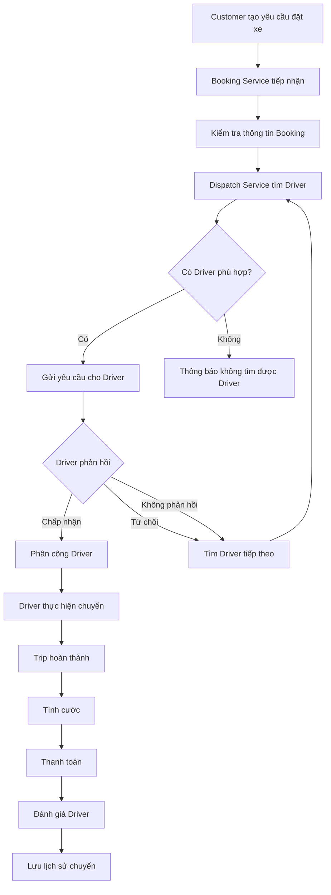
---
# 9.3. Business Process – Đặt xe
## 9.3.1. Mục tiêu
Cho phép Customer tạo yêu cầu đặt xe bằng cách nhập điểm đón, điểm đến và lựa chọn loại xe.
## 9.3.2. Quy trình
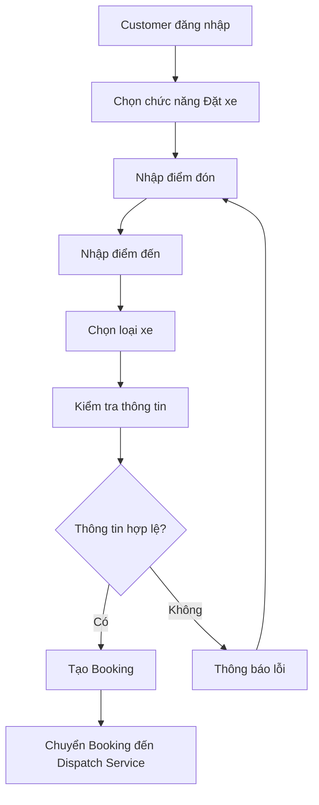
## 9.3.3. Các bước xử lý
| STT | Thành phần | Hoạt động |
|---|---|---|
| 1 | Customer | Đăng nhập hệ thống |
| 2 | Customer | Chọn chức năng đặt xe |
| 3 | Customer | Nhập điểm đón |
| 4 | Customer | Nhập điểm đến |
| 5 | Customer | Chọn loại xe |
| 6 | Booking Service | Kiểm tra thông tin |
| 7 | Booking Service | Tạo Booking |
| 8 | Booking Service | Chuyển yêu cầu đến Dispatch Service |
---
# 9.4. Business Process – Tìm và phân công Driver
## 9.4.1. Mục tiêu
Tìm Driver phù hợp với yêu cầu của Customer dựa trên trạng thái sẵn sàng, vị trí, loại xe và các tiêu chí vận hành.
## 9.4.2. Quy trình
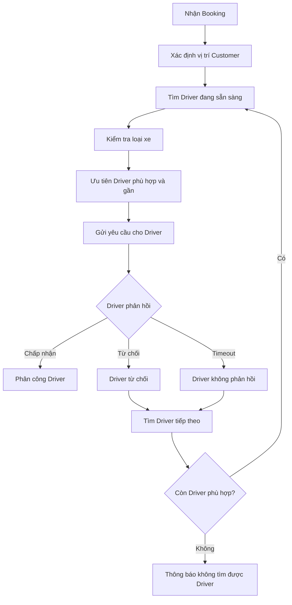
## 9.4.3. Các bước xử lý
| STT | Thành phần | Hoạt động |
|---|---|---|
| 1 | Dispatch Service | Nhận Booking |
| 2 | Location Service | Xác định vị trí Customer |
| 3 | Dispatch Service | Tìm Driver đang sẵn sàng |
| 4 | Dispatch Service | Kiểm tra loại xe |
| 5 | Dispatch Service | Lọc Driver phù hợp |
| 6 | Dispatch Service | Ưu tiên Driver gần Customer |
| 7 | Notification Service | Gửi yêu cầu cho Driver |
| 8 | Driver | Chấp nhận hoặc từ chối chuyến |
| 9 | Dispatch Service | Phân công Driver |
| 10 | Dispatch Service | Tìm Driver tiếp theo nếu thất bại |
| 11 | Notification Service | Thông báo kết quả cho Customer |
> **Lưu ý:** Tiêu chí ưu tiên Driver, thời gian phản hồi và số lần tìm lại Driver chưa được khách hàng chốt.
---
# 9.5. Business Process – Thực hiện chuyến
## 9.5.1. Mục tiêu
Quản lý trạng thái Trip từ khi Driver nhận chuyến đến khi chuyến hoàn thành.
## 9.5.2. Quy trình
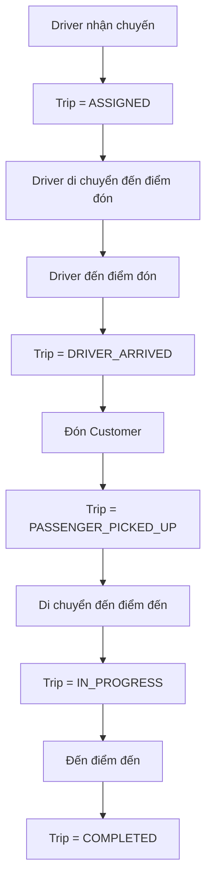
## 9.5.3. Trạng thái Trip
```text
ASSIGNED
    ↓
DRIVER_ARRIVED
    ↓
PASSENGER_PICKED_UP
    ↓
IN_PROGRESS
    ↓
COMPLETED
```
## 9.5.4. Bảng chuyển trạng thái
| Trạng thái hiện tại | Trạng thái tiếp theo | Actor |
|---|---|---|
| ASSIGNED | DRIVER_ARRIVED | Driver |
| DRIVER_ARRIVED | PASSENGER_PICKED_UP | Driver |
| PASSENGER_PICKED_UP | IN_PROGRESS | Driver |
| IN_PROGRESS | COMPLETED | Driver |
---
# 9.6. Business Process – Cập nhật vị trí GPS
## 9.6.1. Mục tiêu
Cập nhật vị trí hiện tại của Driver để hỗ trợ tìm Driver và theo dõi Trip.
## 9.6.2. Quy trình
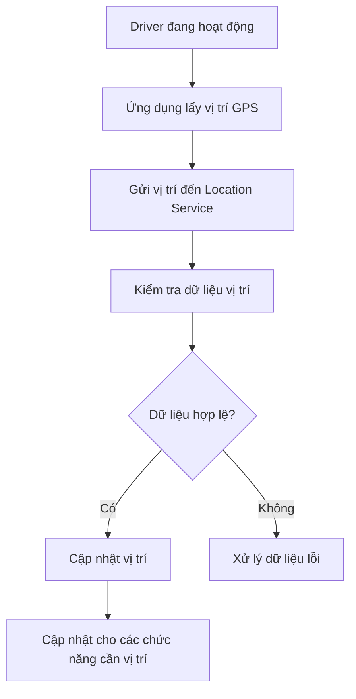
## 9.6.3. Các bước xử lý
| STT | Thành phần | Hoạt động |
|---|---|---|
| 1 | Driver App | Lấy vị trí GPS |
| 2 | Driver App | Gửi dữ liệu vị trí |
| 3 | Location Service | Kiểm tra dữ liệu |
| 4 | Location Service | Cập nhật vị trí |
| 5 | Dispatch Service | Sử dụng vị trí để tìm Driver |
| 6 | Trip Service | Sử dụng vị trí để theo dõi Trip |
---
# 9.7. Business Process – Tính cước và thanh toán
## 9.7.1. Mục tiêu
Xác định số tiền Customer phải trả sau khi Trip hoàn thành và xử lý thanh toán.
## 9.7.2. Quy trình
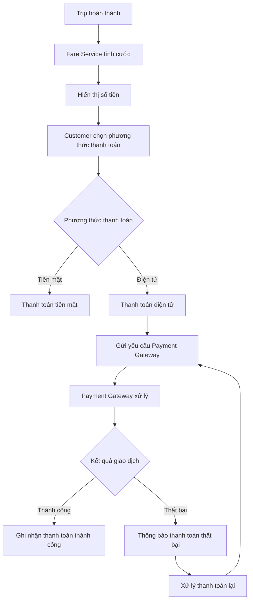
## 9.7.3. Các bước xử lý
| STT | Thành phần | Hoạt động |
|---|---|---|
| 1 | Trip Service | Xác nhận Trip hoàn thành |
| 2 | Fare Service | Tính cước |
| 3 | Customer | Chọn phương thức thanh toán |
| 4 | Payment Service | Xử lý thanh toán |
| 5 | Payment Gateway | Xử lý giao dịch điện tử |
| 6 | Payment Service | Nhận kết quả giao dịch |
| 7 | Notification Service | Gửi kết quả thanh toán |
> **Lưu ý:** Công thức tính cước và chính sách Retry khi thanh toán thất bại cần được xác nhận với khách hàng.
---
# 9.8. Business Process – Gửi thông báo
## 9.8.1. Mục tiêu
Gửi thông báo đến Customer và Driver khi xảy ra các sự kiện quan trọng.
## 9.8.2. Quy trình
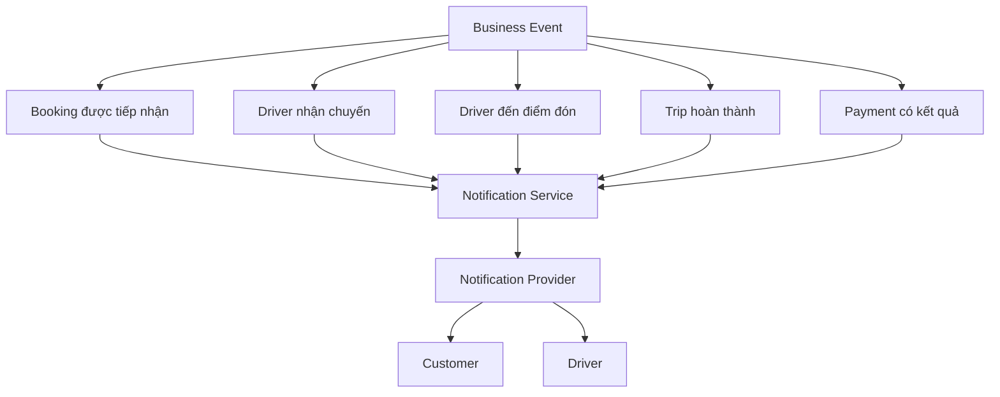
## 9.8.3. Các sự kiện thông báo
| Sự kiện | Người nhận |
|---|---|
| Booking được tiếp nhận | Customer |
| Driver nhận chuyến | Customer |
| Có chuyến mới | Driver |
| Driver đến điểm đón | Customer |
| Trip hoàn thành | Customer |
| Thanh toán thành công | Customer |
| Thanh toán thất bại | Customer |
| Có thay đổi liên quan đến Trip | Customer / Driver |
---
# 9.9. Business Process – Theo dõi chuyến đi
## 9.9.1. Mục tiêu
Cho phép Customer theo dõi trạng thái và vị trí của Driver trong quá trình thực hiện Trip.
## 9.9.2. Quy trình
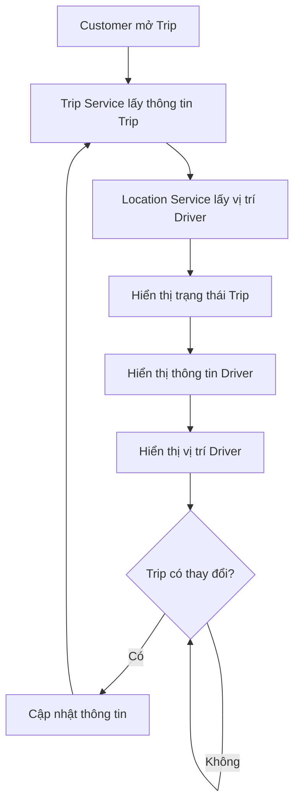
## 9.9.3. Thông tin Customer có thể theo dõi
- Trạng thái tìm Driver.
- Driver đã nhận chuyến.
- Thông tin Driver.
- Thời gian dự kiến Driver đến.
- Vị trí Driver.
- Trạng thái hiện tại của Trip.
---
# 9.10. Business Process – Đánh giá Driver
## 9.10.1. Mục tiêu
Cho phép Customer đánh giá Driver sau khi Trip hoàn thành.
## 9.10.2. Quy trình
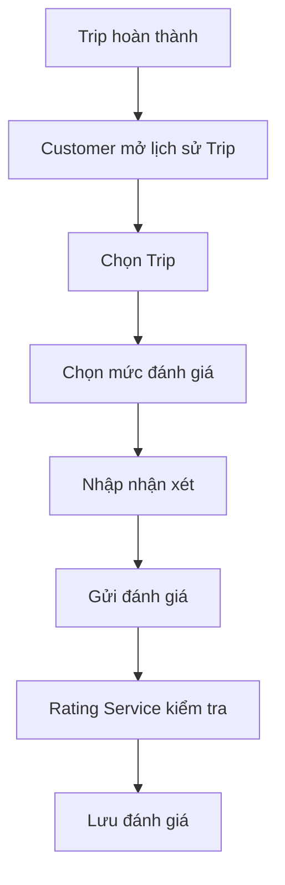
## 9.10.3. Điều kiện
- Trip phải ở trạng thái `COMPLETED`.
- Customer phải là người thực hiện Trip.
- Customer chỉ được đánh giá theo chính sách của hệ thống.
---
# 9.11. Business Process – Xử lý chuyến lỗi
## 9.11.1. Mục tiêu
Cho phép Operation Staff tiếp nhận và xử lý các Trip gặp sự cố.
## 9.11.2. Quy trình
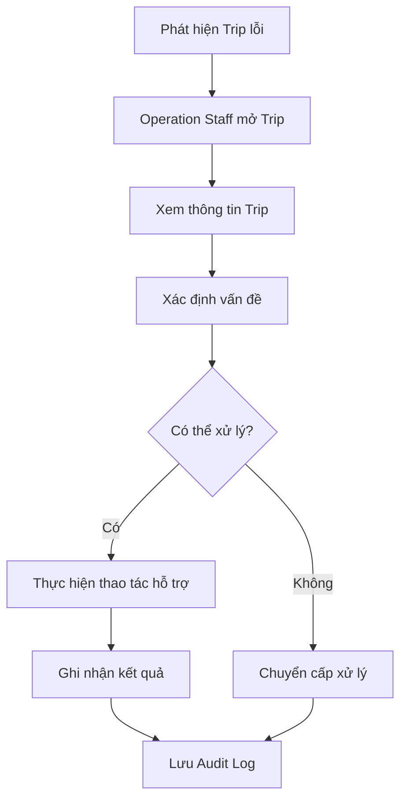
## 9.11.3. Một số trường hợp lỗi
- Driver không cập nhật trạng thái.
- Driver mất kết nối.
- Không cập nhật được vị trí.
- Trip gặp lỗi trong quá trình thực hiện.
- Thanh toán gặp lỗi.
- Customer cần hỗ trợ.
- Driver cần hỗ trợ.
---
# 9.12. Business Process – Quản lý Driver và phương tiện
## 9.12.1. Mục tiêu
Cho phép Operation Staff quản lý thông tin Driver và phương tiện.
## 9.12.2. Quy trình
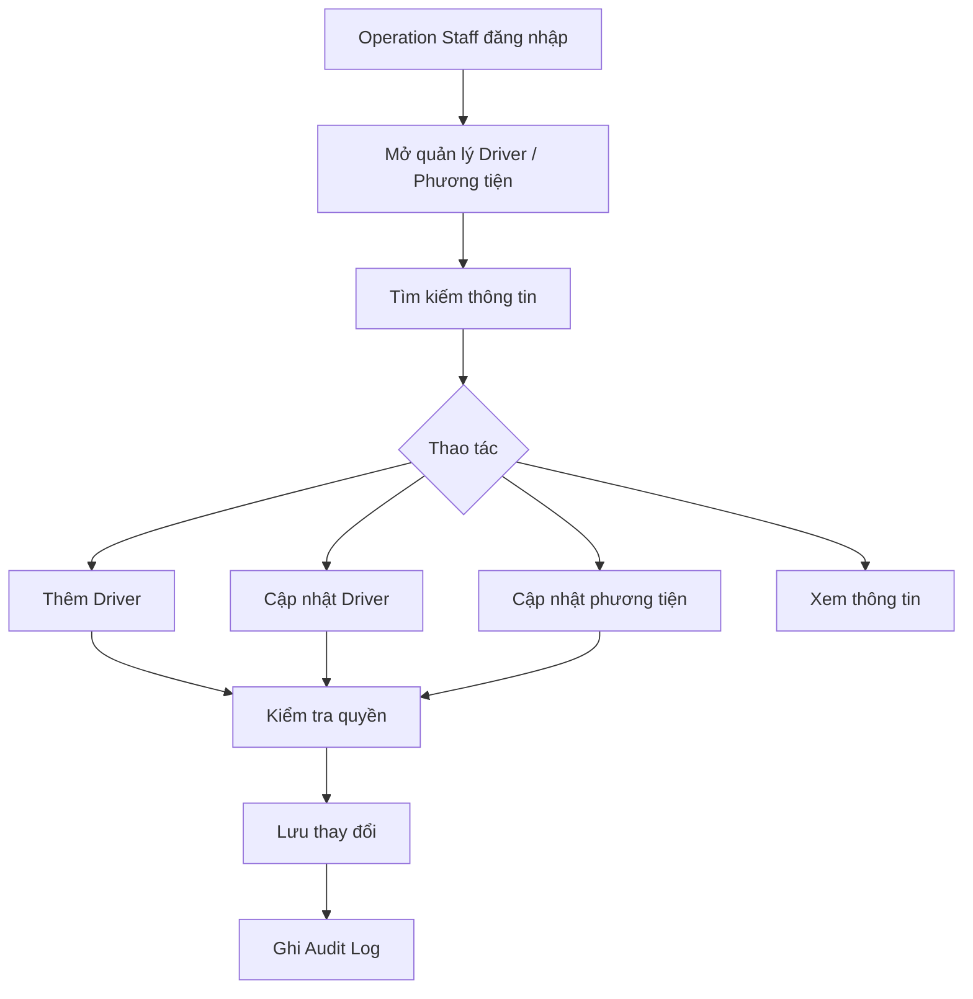
---
# 9.13. Business Process – Báo cáo và thống kê
## 9.13.1. Mục tiêu
Cung cấp dữ liệu giúp Operation Staff và doanh nghiệp theo dõi tình hình hoạt động của hệ thống.
## 9.13.2. Quy trình
```mermaid
flowchart TD
    A[Operation Staff đăng nhập]
    B[Mở chức năng báo cáo]
    C[Chọn khoảng thời gian]
    D[Chọn loại báo cáo]
    E[Truy vấn dữ liệu]
    F[Tổng hợp dữ liệu]
    G[Hiển thị báo cáo]
    A --> B
    B --> C
    C --> D
    D --> E
    E --> F
    F --> G
```
## 9.13.3. Các chỉ số chính
| Chỉ số | Ý nghĩa |
|---|---|
| Số lượng Trip | Tổng số chuyến |
| Doanh thu | Tổng doanh thu |
| Tỷ lệ hoàn thành | Số Trip hoàn thành / tổng Trip |
| Tỷ lệ hủy | Số Trip hủy / tổng Trip |
| Hiệu quả Driver | Đánh giá hoạt động của Driver |
---
# 9.14. Business Process – Quản lý tài khoản và phân quyền
## 9.14.1. Mục tiêu
Cho phép System Admin quản lý tài khoản và quyền truy cập.
## 9.14.2. Quy trình
```mermaid
flowchart TD
    A[System Admin đăng nhập]
    B[Mở quản lý tài khoản]
    C[Chọn tài khoản]
    D[Kiểm tra quyền Admin]
    E{Thao tác}
    F[Tạo tài khoản]
    G[Cập nhật tài khoản]
    H[Khóa / mở tài khoản]
    I[Phân quyền]
    J[Lưu thay đổi]
    K[Ghi Audit Log]
    A --> B
    B --> C
    C --> D
    D --> E
    E --> F
    E --> G
    E --> H
    E --> I
    F --> J
    G --> J
    H --> J
    I --> J
    J --> K
```
---
# 9.15. Business Process tổng hợp theo Service
```mermaid
flowchart LR
    Customer((Customer))
    Driver((Driver))
    Booking[Booking Service]
    Dispatch[Dispatch Service]
    Location[Location Service]
    Trip[Trip Service]
    Fare[Fare Service]
    Payment[Payment Service]
    Rating[Rating Service]
    Notification[Notification Service]
    Gateway((Payment Gateway))
    Provider((Notification Provider))
    Customer --> Booking
    Booking --> Dispatch
    Driver --> Location
    Location --> Dispatch
    Dispatch --> Driver
    Dispatch --> Trip
    Driver --> Trip
    Trip --> Fare
    Fare --> Payment
    Payment --> Gateway
    Trip --> Notification
    Payment --> Notification
    Dispatch --> Notification
    Notification --> Provider
    Customer --> Rating
    Rating --> Trip
```
---
# 9.16. Luồng nghiệp vụ End-to-End
```text
Customer
   |
   v
Đăng nhập
   |
   v
Tạo Booking
   |
   v
Booking Service
   |
   v
Dispatch Service
   |
   v
Tìm Driver phù hợp
   |
   +------> Driver từ chối
   |              |
   |              v
   |        Tìm Driver khác
   |              |
   |              +--------+
   |                       |
   +------> Driver nhận <--+
              |
              v
        Trip Service
              |
              v
       Driver thực hiện Trip
              |
              v
        Trip COMPLETED
              |
              v
         Fare Service
              |
              v
       Payment Service
              |
        +-----+-----+
        |           |
        v           v
   Tiền mặt      Điện tử
                    |
                    v
             Payment Gateway
                    |
                    v
             Kết quả Payment
                    |
                    v
          Notification Service
                    |
                    v
               Customer
                    |
                    v
             Đánh giá Driver
                    |
                    v
              Lưu lịch sử
```
---
# 9.17. Mapping Business Process với Service
| Business Process | Service chính | Actor |
|---|---|---|
| Đăng nhập / Xác thực | Authentication Service | Customer, Driver, Staff, Admin |
| Đặt xe | Booking Service | Customer |
| Tìm Driver | Dispatch Service | System |
| Cập nhật vị trí | Location Service | Driver |
| Nhận / Từ chối chuyến | Dispatch Service | Driver |
| Thực hiện Trip | Trip Service | Driver |
| Theo dõi Trip | Trip Service + Location Service | Customer |
| Tính cước | Fare Service | System |
| Thanh toán | Payment Service | Customer |
| Đánh giá | Rating Service | Customer |
| Gửi thông báo | Notification Service | Customer, Driver |
| Quản lý Driver | Operation Service | Operation Staff |
| Giám sát Trip | Operation Service | Operation Staff |
| Xử lý Trip lỗi | Operation Service | Operation Staff |
| Báo cáo | Operation Service | Operation Staff |
| Phân quyền | Authorization Service | System Admin |
---
# 9.18. Các trường hợp ngoại lệ
| STT | Trường hợp | Cách xử lý |
|---|---|---|
| 1 | Không có Driver phù hợp | Thông báo Customer |
| 2 | Driver từ chối chuyến | Tìm Driver tiếp theo |
| 3 | Driver không phản hồi | Timeout và tìm Driver khác |
| 4 | Mất kết nối GPS | Sử dụng vị trí gần nhất nếu có |
| 5 | Mất kết nối mạng | Xử lý theo trạng thái cuối cùng |
| 6 | Thanh toán thất bại | Thông báo và xử lý lại |
| 7 | Notification thất bại | Retry theo chính sách hệ thống |
| 8 | Staff không có quyền | Từ chối thao tác |
| 9 | Dữ liệu không hợp lệ | Yêu cầu nhập lại |
| 10 | Trip gặp sự cố | Operation Staff tiếp nhận xử lý |
---
## 10. Business Rules
## 10.1. Quy tắc về tài khoản và xác thực
| Rule ID | Quy tắc nghiệp vụ | Mô tả |
|---|---|---|
| **BRL-01** | Đăng ký tài khoản | Customer phải có tài khoản để sử dụng các chức năng yêu cầu đăng nhập. |
| **BRL-02** | Xác thực đăng nhập | Người dùng phải đăng nhập và được xác thực trước khi truy cập hệ thống. |
| **BRL-03** | Phân quyền người dùng | Người dùng chỉ được sử dụng các chức năng phù hợp với vai trò và quyền được cấp. |
| **BRL-04** | Từ chối truy cập | Hệ thống phải từ chối thao tác nếu người dùng không có quyền. |
---
## 10.2. Quy tắc về đặt xe
| Rule ID | Quy tắc nghiệp vụ | Mô tả |
|---|---|---|
| **BRL-05** | Thông tin đặt xe | Booking phải có điểm đón, điểm đến và loại xe. |
| **BRL-06** | Kiểm tra Booking | Hệ thống phải kiểm tra thông tin trước khi tạo Booking. |
| **BRL-07** | Tạo Booking | Booking chỉ được tạo khi thông tin hợp lệ. |
| **BRL-08** | Tìm Driver | Sau khi Booking được tạo, hệ thống bắt đầu tìm Driver phù hợp. |
---
## 10.3. Quy tắc về tìm và phân công Driver
| Rule ID | Quy tắc nghiệp vụ | Mô tả |
|---|---|---|
| **BRL-09** | Driver sẵn sàng | Chỉ Driver ở trạng thái sẵn sàng mới được xem xét nhận chuyến. |
| **BRL-10** | Driver phù hợp | Driver phải đáp ứng loại xe và các tiêu chí của Booking. |
| **BRL-11** | Ưu tiên Driver gần | Hệ thống ưu tiên Driver phù hợp và gần Customer. |
| **BRL-12** | Driver chấp nhận | Khi Driver chấp nhận, hệ thống phân công Driver cho Trip. |
| **BRL-13** | Driver từ chối | Nếu Driver từ chối, hệ thống tiếp tục tìm Driver khác. |
| **BRL-14** | Driver không phản hồi | Nếu Driver không phản hồi trong thời gian quy định, hệ thống tìm Driver khác. |
| **BRL-15** | Không tìm được Driver | Nếu không có Driver phù hợp, hệ thống phải thông báo cho Customer. |
> **Cần xác nhận:** Tiêu chí ưu tiên Driver và thời gian Driver phải phản hồi.
---
## 10.4. Quy tắc về chuyến đi
| Rule ID | Quy tắc nghiệp vụ | Mô tả |
|---|---|---|
| **BRL-16** | Driver được phân công | Trip chỉ được thực hiện khi đã có Driver nhận chuyến. |
| **BRL-17** | Cập nhật trạng thái | Driver phải cập nhật trạng thái Trip trong quá trình thực hiện. |
| **BRL-18** | Cập nhật vị trí | Hệ thống tiếp nhận vị trí Driver để hỗ trợ theo dõi Trip. |
| **BRL-19** | Theo dõi Trip | Customer được theo dõi Driver và trạng thái Trip của mình. |
| **BRL-20** | Hoàn thành Trip | Khi chuyến kết thúc, Trip phải được cập nhật thành `COMPLETED`. |
| **BRL-21** | Hủy Trip | Việc hủy Trip phải tuân theo chính sách hủy chuyến của doanh nghiệp. |
> **Cần xác nhận:** Chính sách hủy chuyến và cách xử lý khi Driver mất kết nối.
---
## 10.5. Quy tắc về tính cước
| Rule ID | Quy tắc nghiệp vụ | Mô tả |
|---|---|---|
| **BRL-22** | Điều kiện tính cước | Hệ thống tính cước sau khi Trip hoàn thành. |
| **BRL-23** | Tính cước | Cước được xác định dựa trên loại dịch vụ và thông tin Trip. |
| **BRL-24** | Xác định số tiền | Số tiền phải trả phải được xác định trước khi thanh toán. |
| **BRL-25** | Lưu thông tin cước | Kết quả tính cước phải được liên kết với Trip tương ứng. |
> **Cần xác nhận:** Công thức tính cước cụ thể.
---
## 10.6. Quy tắc về thanh toán
| Rule ID | Quy tắc nghiệp vụ | Mô tả |
|---|---|---|
| **BRL-26** | Phương thức thanh toán | Hệ thống hỗ trợ tiền mặt và thanh toán điện tử. |
| **BRL-27** | Thanh toán điện tử | Thanh toán điện tử được xử lý thông qua Payment Gateway. |
| **BRL-28** | Bảo mật thanh toán | CAB System không lưu trực tiếp thông tin nhạy cảm của thẻ hoặc tài khoản thanh toán. |
| **BRL-29** | Ghi nhận kết quả | Hệ thống phải lưu trạng thái kết quả của giao dịch. |
| **BRL-30** | Thanh toán thất bại | Nếu giao dịch thất bại, hệ thống phải thông báo cho Customer. |
| **BRL-31** | Thanh toán lại | Customer có thể thực hiện lại thanh toán theo chính sách doanh nghiệp. |
> **Cần xác nhận:** Số lần và cách Retry khi thanh toán thất bại.
---
## 10.7. Quy tắc về thông báo
| Rule ID | Quy tắc nghiệp vụ | Mô tả |
|---|---|---|
| **BRL-32** | Thông báo Booking | Customer được thông báo khi yêu cầu đặt xe được tiếp nhận. |
| **BRL-33** | Thông báo Driver | Customer được thông báo khi có Driver nhận chuyến và đến điểm đón. |
| **BRL-34** | Thông báo cho Driver | Driver được thông báo khi có Booking mới phù hợp. |
| **BRL-35** | Thông báo hoàn thành | Customer được thông báo khi Trip hoàn thành. |
| **BRL-36** | Thông báo Payment | Customer được thông báo kết quả thanh toán. |
| **BRL-37** | Lỗi Notification | Lỗi gửi thông báo không được làm dừng quá trình Booking hoặc Trip. |
---
## 10.8. Quy tắc về đánh giá và lịch sử
| Rule ID | Quy tắc nghiệp vụ | Mô tả |
|---|---|---|
| **BRL-38** | Đánh giá sau Trip | Customer chỉ được đánh giá Driver sau khi Trip hoàn thành. |
| **BRL-39** | Lưu đánh giá | Hệ thống phải lưu đánh giá gắn với Customer, Driver và Trip. |
| **BRL-40** | Lịch sử Trip | Customer được xem lịch sử các Trip của mình. |
| **BRL-41** | Thông tin lịch sử | Lịch sử Trip phải có thông tin chuyến và số tiền thanh toán. |
---
## 10.9. Quy tắc về quản lý vận hành
| Rule ID | Quy tắc nghiệp vụ | Mô tả |
|---|---|---|
| **BRL-42** | Quản lý Customer | Operation Staff có quyền phù hợp được tra cứu và quản lý Customer. |
| **BRL-43** | Quản lý Driver | Operation Staff có thể quản lý thông tin Driver theo quyền được cấp. |
| **BRL-44** | Quản lý phương tiện | Operation Staff có thể quản lý thông tin phương tiện. |
| **BRL-45** | Giám sát Trip | Operation Staff có thể theo dõi các Trip đang diễn ra. |
| **BRL-46** | Xử lý Trip lỗi | Operation Staff có thể kiểm tra và hỗ trợ xử lý Trip gặp sự cố. |
| **BRL-47** | Tra cứu giao dịch | Nhân viên có quyền có thể tra cứu lịch sử giao dịch. |
---
## 10.10. Quy tắc về báo cáo
| Rule ID | Quy tắc nghiệp vụ | Mô tả |
|---|---|---|
| **BRL-48** | Báo cáo số chuyến | Hệ thống thống kê số lượng Trip theo khoảng thời gian. |
| **BRL-49** | Báo cáo doanh thu | Hệ thống hỗ trợ thống kê doanh thu. |
| **BRL-50** | Tỷ lệ hoàn thành | Hệ thống thống kê tỷ lệ Trip hoàn thành. |
| **BRL-51** | Tỷ lệ hủy | Hệ thống thống kê tỷ lệ Trip bị hủy. |
| **BRL-52** | Hiệu quả Driver | Hệ thống cung cấp dữ liệu để đánh giá hiệu quả Driver. |
---
## 10.11. Quy tắc về phân quyền và Audit Log
| Rule ID | Quy tắc nghiệp vụ | Mô tả |
|---|---|---|
| **BRL-53** | Kiểm tra quyền | Các chức năng quản trị phải kiểm tra quyền trước khi thực hiện. |
| **BRL-54** | Quản lý quyền | System Admin được quản lý tài khoản và phân quyền người dùng. |
| **BRL-55** | Audit Log | Các thao tác quan trọng phải được hệ thống ghi lại. |
| **BRL-56** | Bảo vệ Audit Log | Chỉ người có quyền mới được truy cập Audit Log. |
---
## 10.12. Quy tắc về hệ thống và Service
| Rule ID | Quy tắc nghiệp vụ | Mô tả |
|---|---|---|
| **BRL-57** | Độc lập Service | Lỗi Payment hoặc Notification không được làm toàn bộ hệ thống đặt xe ngừng hoạt động. |
| **BRL-58** | Khả năng mở rộng | Các Service phải có khả năng mở rộng độc lập khi tải tăng. |
| **BRL-59** | Mở rộng chức năng | Hệ thống phải hỗ trợ bổ sung dịch vụ hoặc chức năng mới trong tương lai. |
| **BRL-60** | Thay đổi Provider | Payment Gateway và Notification Provider có thể được thay đổi mà hạn chế ảnh hưởng Service khác. |
---
## 10.13. Các quy tắc cần xác nhận với khách hàng
Một số Business Rules chưa thể xác định chính xác từ yêu cầu hiện tại:
| STT | Nội dung cần xác nhận |
|---|---|
| 1 | Công thức tính cước |
| 2 | Tiêu chí ưu tiên Driver |
| 3 | Khoảng cách tìm Driver |
| 4 | Thời gian Driver phải phản hồi |
| 5 | Số lần tìm lại Driver |
| 6 | Chính sách hủy chuyến |
| 7 | Cách xử lý khi mất kết nối |
| 8 | Chính sách Retry thanh toán |
| 9 | Tần suất cập nhật vị trí GPS |
| 10 | Thời gian lưu trữ dữ liệu |
---
